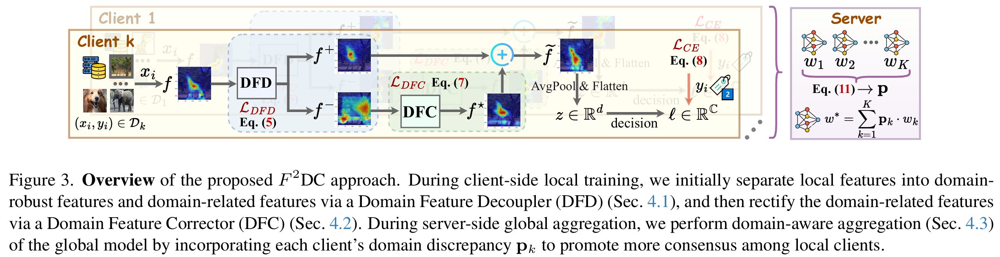

<div align="center">
  <h2><b>F<sup>2</sup>DC - Federated Feature Decoupling and Calibration (CVPR 2026)</b></h2>
</div>

<div align="center">


[](https://opensource.org/licenses/Apache-2.0)

</div>

Official implementation of [Domain-Skewed Federated Learning with Feature Decoupling and Calibration](http://arxiv.org/abs/2603.14238).

## Abstract

Federated Learning (FL) allows distributed clients to collaboratively train a global model in a privacy-preserving manner. However, one major challenge is domain skew, where clients' data originating from diverse domains may hinder the aggregated global model from learning a consistent representation space, resulting in poor generalizable ability in multiple domains. In this paper, we argue that the domain skew is reflected in the domain-specific biased features of each client, causing the local model's representations to collapse into a narrow low-dimensional subspace. We then propose **F**ederated **F**eature **D**ecoupling and **C**alibration (**$F^{2}DC$**), which liberates valuable class-relevant information by calibrating the domain-specific biased features, enabling more consistent representations across domains. A novel component, Domain Feature Decoupler (DFD), is first introduced in $F^{2}DC$ to determine the robustness of each feature unit, thereby separating the local features into domain-robust features and domain-related features. A Domain Feature Corrector (DFC) is further proposed to calibrate these domain-related features by explicitly linking discriminative signals, capturing additional class-relevant clues that complement the domain-robust features. Finally, a domain-aware aggregation of the local models is performed to promote consensus among clients. Empirical results on three popular multi-domain datasets demonstrate the effectiveness of the proposed $F^{2}DC$ and the contributions of its two modules.



## Setup Libraries

- python >= 3.10.11
- torch >= 1.13.0
- torchvision >= 0.14.0
- scipy >= 1.10.1
- scikit-image >= 0.21.0
- numpy >= 1.24.3
- tqdm >= 4.64.0

## Multi-domain Datasets

- **Digits**: include 4 domains (_MNIST, USPS, SVHN, SYN_). 【Download Link -> [[Google Drive]](https://drive.google.com/file/d/11kJ_xVB37J3_AXflccevnK-MJS8ETFcv/view?usp=sharing)】
- **Office-Caltech**: include 4 domains (_Caltech, Amazon, Webcam, DSLR_). 【Download Link -> [[Google Drive]](https://drive.google.com/file/d/1xm-_gh60c8iacCqTIHH0-q7ZUEexZLBo/view?usp=sharing)】
- **PACS**: include 4 domains (_Photo, Art-Painting, Cartoon, Sketch_). 【Download Link -> [[Google Drive]](https://drive.google.com/file/d/1t-z3Lglp1_aArBAhBp4xxKI6_NSwa2qr/view?usp=sharing)】
- After downloading these datasets, please place them in the "./rundata/dataset/" folder.

## Run Experiments

- Run $F^{2}DC$ on **Digits**:
  ```python
  python3 main_run.py --parti_num 20 --model f2dc --dataset fl_digits
  ```
- Run $F^{2}DC$ on **Office-Caltech**:
  ```python
  python3 main_run.py --parti_num 10 --model f2dc --dataset fl_officecaltech
  ```
- Run $F^{2}DC$ on **PACS**:
  ```python
  python3 main_run.py --parti_num 10 --model f2dc --dataset fl_pacs
  ```

## Citation

```
@inproceedings{WangF2DC_CVPR26,
    author={Wang, Huan and Shen, Jun and Yan, Jun and Pang, Guansong},
    title={Domain-Skewed Federated Learning with Feature Decoupling and Calibration},
    booktitle={Proceedings of the IEEE/CVF Conference on Computer Vision and Pattern Recognition},
    year={2026}
}
```
